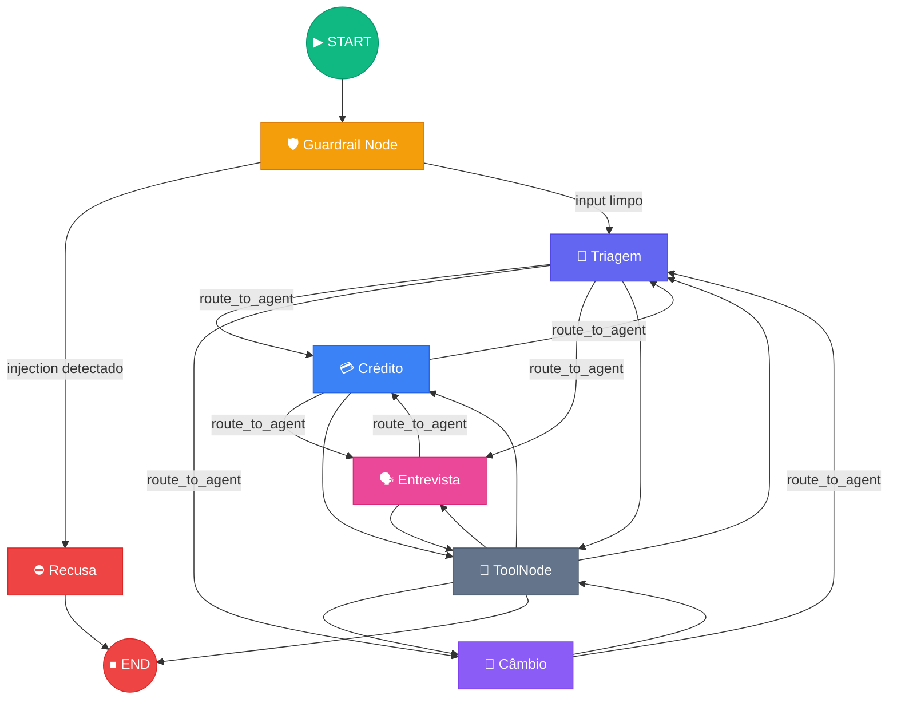
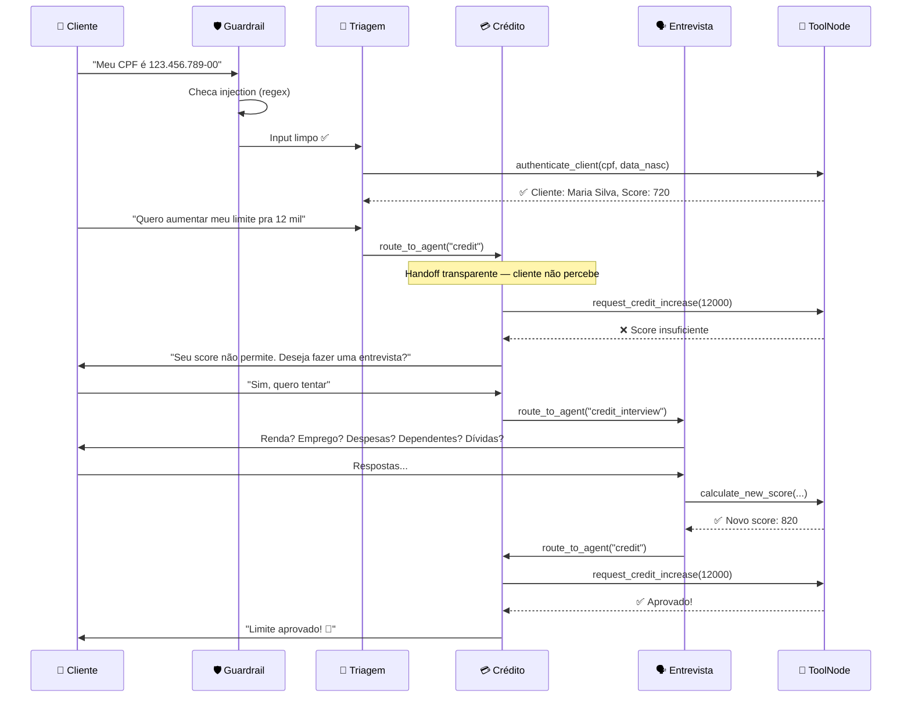
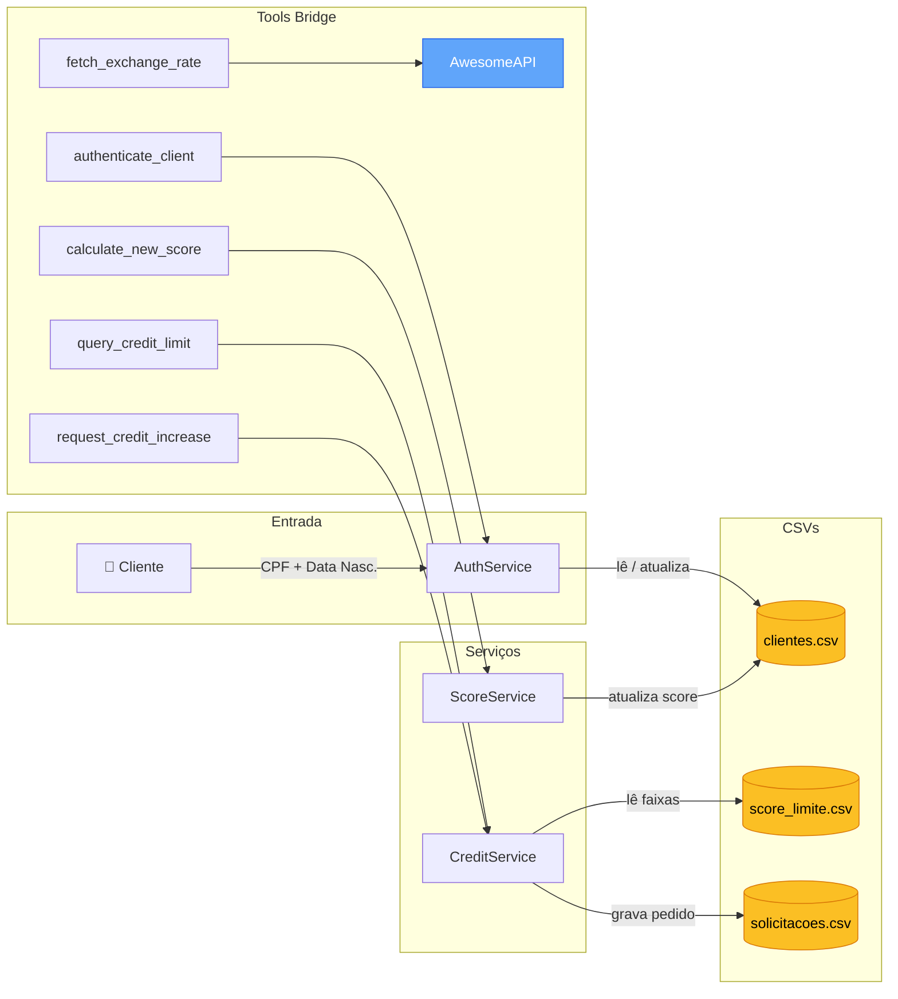

<div align="center">

# 🏦 Banco Ágil

**Sistema Multi-Agente de Atendimento Bancário Virtual**

[](https://python.org)
[](https://langchain-ai.github.io/langgraph/)
[](https://ai.google.dev/)
[](https://chainlit.io)
[](https://docker.com)
[](LICENSE)

---

*Agentes especializados orquestrados por LangGraph com handoffs transparentes — o cliente percebe um único atendente.*

</div>

## Visão Geral

O **Banco Ágil** é um sistema de atendimento virtual para um banco digital fictício, onde agentes de IA especializados trabalham em conjunto para atender o cliente de forma transparente. O cliente percebe uma conversa fluida com um único atendente — os handoffs entre agentes são invisíveis.

O sistema foi construído com **LangGraph** (orquestração de agentes como grafo de estados), **LangChain** (integração com LLM e tool calling), **Google Gemini** como modelo de linguagem e **Chainlit** como interface de chat.

### Agentes do Sistema

| Agente | Responsabilidade |
|--------|-----------------|
| 🔐 **Triagem** | Autenticação por CPF + data de nascimento e roteamento para o agente adequado |
| 💳 **Crédito** | Consulta de limite e solicitação de aumento (aprovação/rejeição por faixa de score) |
| 🗣️ **Entrevista de Crédito** | Recálculo de score via entrevista financeira com 5 perguntas ponderadas |
| 💱 **Câmbio** | Cotação de moedas em tempo real via API externa (AwesomeAPI) |

---

## Arquitetura do Sistema

### Grafo de Agentes (LangGraph StateGraph)

Cada agente é um **node** no grafo. O roteamento entre eles é feito por **edges condicionais** baseadas na decisão do LLM (via tool calling), não por keywords fixas.



### Fluxo de Conversa



### Estado Compartilhado (`AgentState`)

O grafo mantém um estado tipado que flui entre todos os nodes:

| Campo | Tipo | Descrição |
|-------|------|-----------|
| `messages` | `list[BaseMessage]` | Histórico completo da conversa |
| `current_agent` | `str` | Agente que está processando a mensagem |
| `client_data` | `dict` | Dados do cliente autenticado (nome, CPF, score, limite) |
| `conversation_ended` | `bool` | Flag de encerramento |

Após a autenticação, `client_data` é injetado nos prompts de todos os agentes via `build_system_prompt()`. O LLM sabe com quem está falando e usa esses dados nas tool calls sem pedir novamente.

### Fluxo de Dados



---

## Funcionalidades Implementadas

### 🔐 Autenticação com Lock

- Coleta de CPF e data de nascimento via conversa natural
- Normalização automática de formatos (o LLM extrai e padroniza)
- Validação contra a base `clientes.csv`
- Bloqueio após 3 tentativas consecutivas com falha

### 💳 Consulta e Aumento de Limite de Crédito

- Consulta do limite atual com base nos dados do cliente autenticado
- Solicitação de aumento com validação automática contra faixas de score (`score_limite.csv`)
- Registro de cada solicitação em `solicitacoes_aumento_limite.csv` com timestamp ISO 8601 e status (`pendente` → `aprovado` ou `rejeitado`)
- Em caso de rejeição, oferta de redirecionamento para a entrevista de crédito

### 🗣️ Entrevista de Crédito (Recálculo de Score)

Entrevista conversacional com 5 perguntas:

1. Renda mensal
2. Tipo de emprego (formal, autônomo, desempregado)
3. Despesas fixas mensais
4. Número de dependentes
5. Existência de dívidas ativas

**Fórmula de score** (0 a 1000):

```
score = (renda / (despesas + 1)) × 30
      + peso_emprego           # formal=300, autônomo=200, desempregado=0
      + peso_dependentes       # 0→100, 1→80, 2→60, 3+→30
      + peso_dividas           # não→100, sim→-100
```

O score calculado é atualizado diretamente no `clientes.csv`, e o cliente é redirecionado de volta ao Agente de Crédito para nova análise.

### 💱 Cotação de Câmbio

- Consulta em tempo real via AwesomeAPI (`economia.awesomeapi.com.br`)
- Suporte a múltiplas moedas: USD, EUR, GBP, entre outras
- Apresentação da cotação com valor de compra e venda

### 🛡️ Guardrails de Segurança

- **Camada determinística (regex):** Detecção de prompt injection na entrada do grafo, antes de qualquer chamada ao LLM. Custo zero de tokens, latência zero.
- **Camada semântica (LLM):** Guardrails de escopo nos prompts de cada agente, garantindo que nenhum agente atue fora da sua responsabilidade.

### 🔄 Handoffs Transparentes

Todos os redirecionamentos entre agentes são invisíveis para o cliente. O LLM é instruído via prompt a nunca mencionar "transferência" ou "outro departamento". A tool `route_to_agent` altera o `current_agent` no estado do grafo, e o próximo agente continua a conversa com contexto completo.

---

## Desafios Enfrentados e Soluções

<details>
<summary><strong>1. Gemini rejeita declarações duplicadas de tool</strong></summary>

**Problema:** Agentes compartilham tools comuns (`route_to_agent`, `end_conversation`). Ao combinar as tools de múltiplos agentes no grafo, o Gemini retornava erro 400 por declarações duplicadas de função.

**Solução:** Deduplicação por nome de tool antes do `bind_tools()`. A função `build_agent_graph()` garante que cada tool apareça uma única vez, independente de quantos agentes a declaram.

</details>

<details>
<summary><strong>2. Gemini 3 Flash retorna content como lista</strong></summary>

**Problema:** O `gemini-3-flash-preview` retorna `response.content` como `list` (multi-part) em vez de `str` em cenários específicos, quebrando o parsing downstream.

**Solução:** Criação de normalizadores `_extract_text()` e `_to_str()` que lidam com ambos os formatos de forma transparente.

</details>

<details>
<summary><strong>3. Accuracy baixa em tool calling com system prompts</strong></summary>

**Problema:** O Gemini priorizava as *descrições das tools* sobre os system prompts na decisão de quando e qual tool chamar. O agente frequentemente "conversava" ao invés de chamar a tool imediata.

**Solução:** Adição de diretivas explícitas nas descrições das tools (ex: "REGRA PRINCIPAL — TOOL CALLING IMEDIATO") e reestruturação dos prompts para reforçar o comportamento esperado. O resultado foi validado nas evals com 100% de accuracy.

</details>

<details>
<summary><strong>4. Duas abstrações de LLM concorrentes</strong></summary>

**Problema:** O projeto inicialmente usava o SDK `google-genai` diretamente e `langchain-google-genai` em paralelo, gerando inconsistências no formato de mensagens e tool calls.

**Solução:** Unificação de toda a comunicação LLM via `langchain-google-genai`, eliminando a dependência direta do SDK e padronizando o pipeline.

</details>

---

## Escolhas Técnicas e Justificativas

### Por que LangGraph?

| Abordagem avaliada | Motivo da rejeição |
|---------------------|-------------------|
| Orchestrator custom com if/else | Roteamento frágil, manutenção pesada |
| LangChain AgentExecutor | Agente único, sem suporte nativo a multi-agentes |
| CrewAI / AutoGen | Overhead de framework, agentes "conversam entre si" quando precisam de controle explícito |

O **LangGraph StateGraph** foi escolhido porque oferece: grafo explícito com edges condicionais, estado tipado compartilhado, tool calling nativo via LangChain, e controle total sobre as transições. Cada agente é uma função que recebe estado e retorna estado — sem mágica, cada edge é explícita e testável.

### Por que Gemini?

- Free tier generoso para desenvolvimento e testes
- Suporte nativo a tool calling (function calling) via LangChain
- Boa performance em tarefas de roteamento e extração de dados estruturados

### Por que Chainlit?

- UI de chat pronta para produção com suporte a streaming
- Integração nativa com LangChain/LangGraph
- Customização visual via CSS
- Suporte a sessões assíncronas (`async`)

### Padrões de Arquitetura

| Padrão | Onde | Por quê |
|--------|------|---------|
| **@tool factories com closure** | `tools_bridge.py` | Cada factory recebe o serviço por closure, evitando globals e facilitando testes com injeção de dependência |
| **Prompts dinâmicos** | `prompts.py` | `build_system_prompt()` injeta dados do cliente no prompt de cada agente após autenticação |
| **Guardrail como node de entrada** | `graph.py` | Primeira barreira é determinística (regex), sem custo de LLM. Guardrails semânticos ficam no prompt |
| **Separação serviços/tools** | `services/` vs `tools_bridge.py` | Lógica de negócio pura nos serviços, integração com LangChain nas tools |

---

## Estrutura do Projeto

```
banco_agil/
├── agents/                     # Definição dos agentes (prompts e tools)
│   ├── triage.py               # Autenticação e roteamento
│   ├── credit.py               # Consulta e aumento de limite
│   ├── credit_interview.py     # Recálculo de score via entrevista
│   ├── exchange.py             # Cotação de moedas
│   └── common.py               # Tools compartilhadas (route, end)
├── core/
│   ├── graph.py                # StateGraph LangGraph (orquestração principal)
│   ├── tools_bridge.py         # @tool factories (ponte serviços → LangChain)
│   ├── prompts.py              # Prompts dinâmicos com dados do cliente
│   ├── guardrails.py           # Injection patterns + guardrail node
│   ├── orchestrator.py         # Orchestrator (usado nas evals)
│   └── llm/                    # Provider LLM (Gemini via langchain-google-genai)
├── services/                   # Lógica de negócio pura (sem dependência de LLM)
│   ├── auth.py                 # Autenticação com lock após 3 tentativas
│   ├── credit.py               # Crédito e faixas de score
│   └── score.py                # Cálculo de score ponderado
├── models/                     # Dataclasses (Cliente, Solicitacao)
├── tools/                      # Utilitários (CSV ops, exchange API)
├── ui/
│   └── app.py                  # Interface Chainlit (async graph.ainvoke)
├── data/                       # CSVs com dados de clientes e configuração
└── config.py                   # Configuração centralizada

evals/                          # Suite de avaliação com LLM
├── datasets/                   # Test cases em JSONL
│   ├── routing_cases.jsonl         # 16 cenários de roteamento
│   ├── tool_calling_cases.jsonl    # 8 cenários de tool calling
│   └── guardrail_cases.jsonl      # 11 cenários de segurança
├── runners/                    # SingleTurnRunner
├── run.py                      # CLI: python -m evals.run --suite all
└── report.py                   # Gerador de relatórios

tests/                          # Testes unitários e de integração
```

---

## Stack Tecnológica

| Camada | Tecnologia |
|--------|-----------|
| 🧩 Orquestração | LangGraph StateGraph |
| 🧠 LLM | Google Gemini (`gemini-3-flash-preview`) via `langchain-google-genai` |
| 🔧 Tools | LangChain `@tool` decorator + `ToolNode` |
| 💬 UI | Chainlit |
| 📊 Dados | CSV (`clientes`, `score_limite`, `solicitações`) |
| 🧪 Testes | pytest |
| 📈 Evals | Suite própria + LangSmith `evaluate()` |
| 🐳 Container | Docker + docker-compose |

---

## Tutorial de Execução e Testes

### Pré-requisitos

- Python 3.11+
- Chave da API Gemini ([Google AI Studio](https://aistudio.google.com/))

### Setup Local

```bash
git clone https://github.com/manazitto/desafio-tecnico-consultor-agents-ia.git
cd desafio-tecnico-consultor-agents-ia
pip install -e ".[dev]"
```

Configurar a chave da API:

```bash
echo "GEMINI_API_KEY=sua-chave-aqui" > banco_agil/.env
```

Iniciar a aplicação:

```bash
chainlit run banco_agil/ui/app.py -w
```

Acessar em `http://localhost:8000`.

### Docker

```bash
docker compose up --build
```

A aplicação estará disponível em `http://localhost:8000`.

### Testes Unitários

```bash
pytest tests/ -v
```

### Evals (requer GEMINI_API_KEY)

As evals validam o comportamento do LLM em 3 dimensões:

| Suite | O que testa | Cases |
|-------|-------------|-------|
| `routing` | LLM roteia para o agente correto dado um input do cliente | 16 |
| `tool_calling` | LLM chama a tool certa com os parâmetros corretos | 8 |
| `guardrails` | LLM recusa inputs fora de escopo e tentativas de injection | 11 |

```bash
python -m evals.run --suite routing --save
python -m evals.run --suite tool_calling --save
python -m evals.run --suite guardrails --save
python -m evals.run --suite all --save
```

---

<div align="center">

**Feito com ☕ e LangGraph**

</div>
